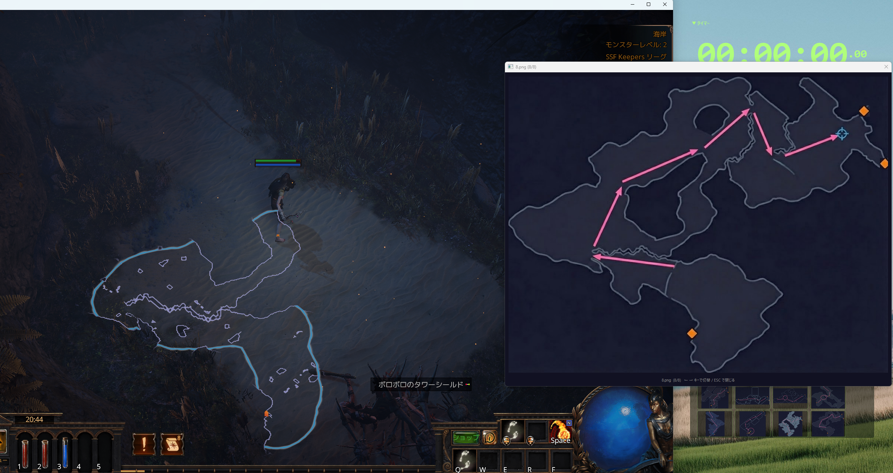
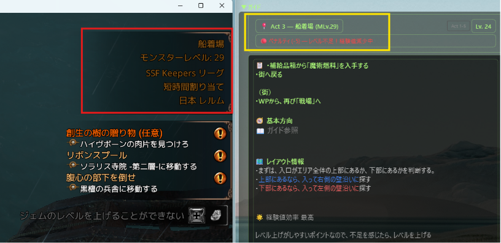

# ぽえなび（PoENavi）

Path of Exile 1 の軽量なレベリングガイド＆タイマーツール。  
**Client.txtログ監視による自動エリア検知**＋**攻略ガイド**＋**マップ画像表示**＋**RTAタイマー**を表示。

---

## ✨ このツールで出来ること

### 📖 攻略ガイド
- エリアごとの**目標・レイアウト情報・Tips**を自動表示
- **マップ画像サムネイル一覧** — クリックで拡大表示（←→キーでページ送り）
- **基本方向矢印** — そのエリアで進むべき方向を大きな矢印で表示
- **経験値効率表示** — 🌟マーク付きで稼ぎポイントがひと目でわかる
- ガイドデータはSetting画面からユーザでも自由に編集可能

※ひな型のガイド情報は、私が過去に作った攻略チャートの内容です。全体の流れを見たい場合などはこちらをご確認ください。
  https://docs.google.com/spreadsheets/d/1fVbL4CPHUw-5IlHoL0ol--_d-YqYSI3uwbmPLignZ8k/edit?gid=1939686731#gid=1939686731

※**マップ画像サムネイル一覧**の画面イメージはこちら。画像１枚目の赤枠部分がサムネイル表示。画像２枚目がそのうちの１枚をクリックして拡大した状態



### 📍 自動エリア検知 & XPペナルティ判定
- **PoEのClient.txtログをリアルタイム監視** — エリア移動・レベルアップを自動検知
- 各エリアのモンスターレベルをもとに、XPペナルティを3段階で判定

| 表示 | 意味 | 条件 |
|------|------|------|
| 🟢 最適レベル | 余裕あり | キャラLv ≤ エリアLv かつ差が余裕ライン以内 |
| 🟡 ペナルティなし | ペナルティは未発生 | 差がペナルティ範囲内だが最適ではない |
| 🔴 ペナルティ | 経験値が減少中 | 差がペナルティ範囲を超過 |

※画像イメージ　Act3の船着き場（Dock）で、エリアレベル29に対して、キャラレベルが24で赤信号が点滅している様子


#### 計算式（PoE公式準拠）

キャラクターレベルとエリアのモンスターレベルの差が一定範囲を超えると、獲得経験値にペナルティが発生します。
参照元：https://www.poewiki.net/wiki/Experience
```
ペナルティ範囲 = キャラLv ÷ 16 + 3（切り捨て）
余裕ライン　　 = キャラLv ÷ 16 + 2（切り捨て）
レベル差　　　 = キャラLv − モンスターLv
```

- **|レベル差| ≤ 余裕ライン** かつ **キャラLv ≤ モンスターLv** → 🟢 最適レベル
- **|レベル差| ≤ ペナルティ範囲** → 🟡 ペナルティなし
  - レベル差が正（キャラが高い）→ 「ややレベル上がり気味」
  - レベル差が負（キャラが低い）→ 「ややレベル不足気味」
- **|レベル差| > ペナルティ範囲** → 🔴 ペナルティ（経験値減少）
  - レベル超過 or レベル不足を表示

例：キャラLv16 → ペナルティ範囲=4、余裕ライン=3

### ⏱️ RTA タイマー
- Act 1〜10 のラップタイム計測
- ホットキーでゲーム中もワンタッチ操作
- 半透明オーバーレイ — ゲーム画面に重ねて使える
- ラン記録の自動保存（JSON形式）
- ※今後のバージョンアップで、ログを使った自動取得を実装予定

### 🪶 軽量設計
- **Client.txtが何GBあっても動作に影響なし** — ファイル末尾だけを効率的に読み取り
  - 起動時: 末尾500KBのみスキャンして最新レベル＆エリアを即復元
  - リアルタイム監視: 前回読み取り位置から差分のみ（500msポーリング）
- CPU負荷ほぼゼロ、メモリ使用量最小限

### 🔒 安全性と透明性
- **ログファイルの読み取りのみ** — ゲームのメモリ、プロセス、ネットワーク通信には一切触れません
- **外部通信なし** — インターネットに一切接続しません。すべてローカル完結
- **ソースコード完全公開** — 何をしているか誰でも確認できます
- GGGが許容する外部ツールの手法（Client.txtログ読み取り）を使用 — Lutbot, Exile Leveling等と同じアプローチです
- exe版が不安な方は、このGithubから取得してもらうことで、ソースから直接実行できます

---

## 📥 インストール

### Option A: exe版（推奨 — Pythonインストール不要）
1. [Releases](../../releases) ページから最新の `.zip` をダウンロード
2. 解凍して `PoENavi.exe` を実行

### Option B: ソースから実行
```bash
git clone https://github.com/buri34/poenavi.git
cd poenavi
pip install -r requirements.txt
python main.py
```

---

## 🚀 使い方

1. アプリを起動
2. ⚙ボタン（または右クリック → Settings）を開く
3. **基本設定** タブ → 「PoE Log File」に `Client.txt` のパスを設定
   - 通常: `C:\Program Files (x86)\Grinding Gear Games\Path of Exile\logs\Client.txt`
   - Steam版: `C:\Program Files (x86)\Steam\steamapps\common\Path of Exile\logs\Client.txt`
4. Save → PoEでプレイ開始！

### ホットキー（デフォルト）
| キー | 機能 |
|------|------|
| F7 | Start / Stop |
| F8 | Reset |
| F9 | Lap（次のActへ） |
| F10 | Undo Lap |

※ Settingsから変更可能

---

## 🗺️ マップ画像

`maps/` フォルダにエリアごとのレイアウト画像を配置すると、ガイド画面にサムネイル一覧が表示されます。
v1.1.0では、まだまだ画像が少なく、Act3までしか対応できていませんが、時間を見て追加していきます。

### フォルダ構造
```
maps/
  海岸/           ← エリア名のフォルダ
    layout1.png
    layout2.png
  牢獄 -下層-/
    pattern_a.png
```

- フォルダ名 = エリア名（zone_dataに登録した名称と一致させる）
- PNG / JPG / GIF / WebP 対応
- サムネイルをクリックすると拡大表示（リサイズ可能、←→キーでナビゲーション）
- 画像は自由に追加・差し替え可能
- Act1-5とAct6-10で同名のエリアがあるところは、エリア名の最後に「#2」をつけることで、Act6-10専用のフォルダになります。

---

## ⚙️ ガイド編集

Settings → **エリア情報** タブで、Act 1〜10の各エリアのガイドデータを編集できます。

- **📝 ガイド編集**: 目標・レイアウト情報・Tips・基本方向を編集

---

## 🔄 Act 1-5 / Act 6-10 切替

PoE1ではAct 6-10の一部エリアがAct 1-5と同名で登場します。  
このアプリでは正しいAct側のガイドを表示するために、自動切替機能を搭載しています。

| トリガー | 説明 |
|----------|------|
| **Act5クリア（自動）** | Act5ボスを倒したときに出力されるログを検知して自動切替 |
| **エリア検知（自動）** | Act 6-10固有エリアに入場で自動切替 |
| **手動ボタン** | UI上のボタンで手動切替 |

---

## 📁 データファイル

| ファイル | 説明 | Git管理 |
|----------|------|---------|
| `config.json` | 設定（ホットキー、ログパス、ゾーンデータ） | ✓（初期設定同梱） |
| `guide_data.json` | 攻略ガイドデータ | ✓（初期データ同梱） |
| `monster_levels.json` | エリア別モンスターレベル | ✓（同梱） |
| `runs/` | ラン記録 | ✕ |
| `maps/` | マップ画像 | ✓（同梱） |

初回起動時、`config.json` と `guide_data.json` はデフォルト値で自動生成されます。

---

## 📝 今後の対応予定

リーグ3.28が開始するまでに以下を実施予定です。
- タイマー機能の自動化（ログファイルをウォッチして自動で各Act終了時などのタイミングを判定して記録）
- マップレイアウト画像の充実化
- Act3で図書館へ行かない場合を考慮したつくり
- Act8で「穀物倉庫」から地下を通るルートを考慮したつくり

---

## 🛠️ Tech Stack

- Python 3.12+
- PySide6 (Qt6)
- pynput（グローバルホットキー）

---

## 📜 License

MIT License — 詳細は [LICENSE](LICENSE) を参照

---

## 🙏 Credits

- [Path of Exile](https://www.pathofexile.com/) by Grinding Gear Games
- Built with ❤️ by [Buri_Isono](https://github.com/buri34)
